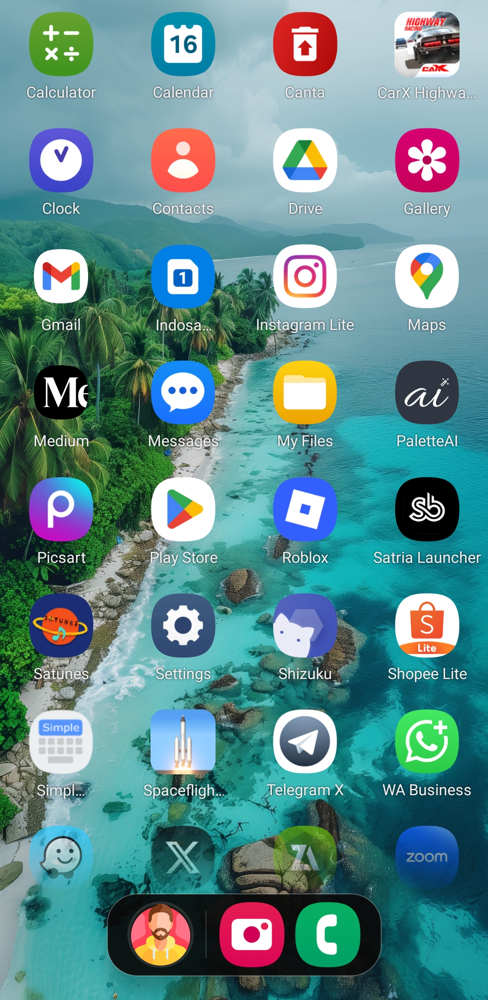
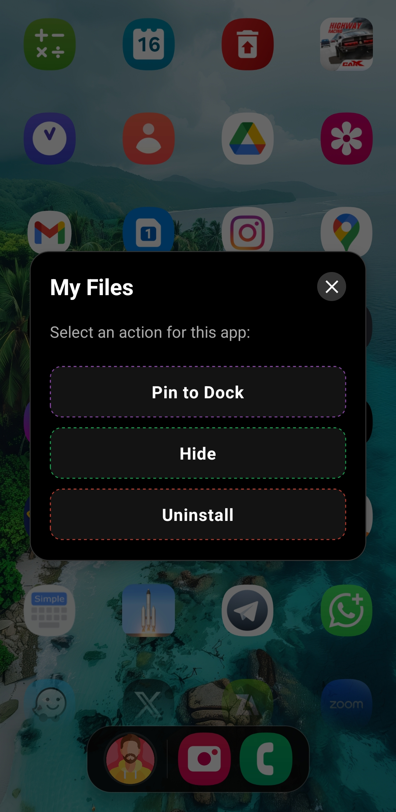
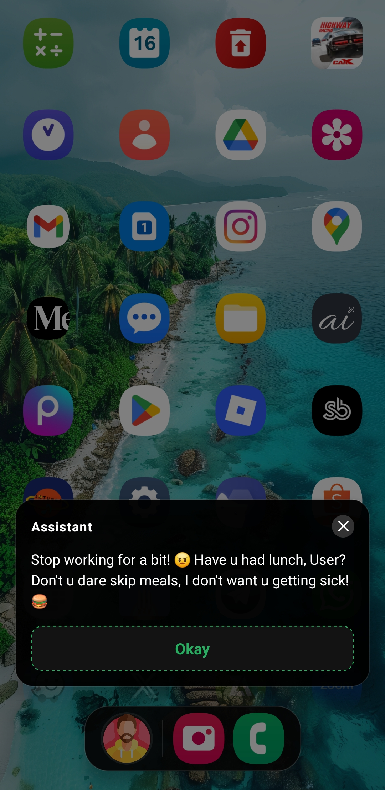
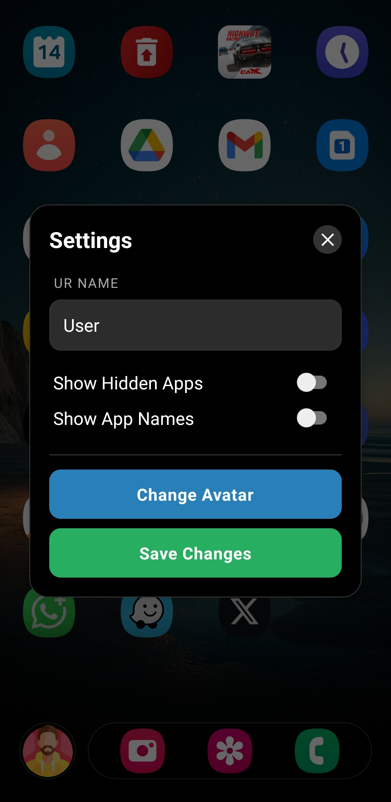

# Satria Launcher 🚀

**Satria Launcher** is a minimalist, high-performance Android launcher built with **React Native**, featuring a Dashboard Dock, advanced app management, and 60 FPS performance.

[](https://reactnative.dev/)
[](https://www.typescriptlang.org/)
[](LICENSE)
[](https://github.com/01satria/)
[](README.md)

---

## ✨ Features

| Category | Highlights |
|----------|-----------|
| **Layout** | Grid (4-col) & List (Niagara-style), instant switch |
| **Dashboard** | Bottom sheet with snap, clock, Weather, Exchange, To-Do, Countdown |
| **App Management** | Hide/unhide, pin to dock (max 4), native uninstall |
| **Performance** | 60 FPS locked |
| **Customization** | Custom avatar, names, toggle app labels, transparent BG |

---

## 📸 Screenshots

| Home | Actions | Dashboard | Settings |
|------|---------|-----------|----------|
|  |  |  |  |

---

## 🎓 Usage

### Gestures

| Action | Gesture |
|--------|---------|
| Launch app | Tap icon |
| App actions (pin, hide, uninstall) | Long press icon |
| Open dashboard | Tap dock avatar |
| Open settings | Long press dock |

### Dashboard
Tap the avatar → bottom sheet snaps to 45%. Drag up for fullscreen, drag down to close.

- 🌤️ **Weather** — Open-Meteo API, no key needed
- 💱 **Money Exchange** — Live rates via open.er-api.com
- ✅ **To-Do List** — Daily tasks in RAM (lightweight)
- ⏳ **Countdown** — Custom native calendar date picker

### Layout Modes
Long press dock → Settings → Layout Mode → **⊞ Grid** or **☰ List**

### Settings Options
Your Name · Assistant Name · Layout Mode · Show Hidden Apps · Show App Names · Change Avatar (200×200px max)

---

## 📊 Performance

| Metric | Value |
|--------|-------|
| Cold Start | ~2.0s |
| Hot Start | ~0.5s |
| RAM – Home | ~95MB |
| RAM – Chat | ~30MB |
| RAM – Background | ~80-80MB |
| FPS | 60 locked |
| APK Size | ~12-15MB |

---

## 🔄 Version History

| Version | Date | Highlights |
|---------|------|------------|
| **v1.5** | Feb 2026 | Dashboard popup, 4 tool cards, performance overhaul |
| **v1.4** | Feb 2026 | Dual layout, smart cache, fullscreen chat |
| **v1.3** | Feb 2026 | Auto period messages, unread badges |
| **v1.2a** | Feb 2026 | Background optimization, dock redesign |
| **v1.2** | Feb 2026 | iOS icons, animations |
| **v1.1** | Jan 2026 | Hide apps, assistant |
| **v1.0** | Dec 2025 | Initial release |

---

## 📝 Changelog

### v1.5 (Current) — Dashboard & Performance Overhaul

**✨ Added**
- **Dashboard Popup** — Draggable bottom sheet replacing AssistantPopup; snap to 45% or fullscreen; drag accessible above ScrollView
- **4 Tool Cards** — Weather (Open-Meteo), Money Exchange (open.er-api.com), To-Do List (RAM), Countdown (custom native calendar)
- **Real-Time Preview** — To-Do and Countdown update instantly on dashboard without reopening
- **Dashboard Header** — Centered avatar + digital clock (10s refresh) + greeting area

**⚡ Optimized**
- Removed `refreshApps()` on AppState active — prevents unnecessary RAM spikes on app resume
- Replaced `Animated.Value` nodes in `SafeAppIcon` with state-based opacity
- Consolidated 3 TypingIndicator dot animations into 1 synchronized component
- FlatList off-screen item recycling made more aggressive

**🐛 Fixed**
- 0.5s freeze on dashboard close — fixed by tracking real-time frame position, removed `stopAnimation`
- Modal close delay — removed all close animation durations for instant dismiss
- Date picker crash (blank screen) — replaced `@react-native-community/datetimepicker` with custom native calendar
- Drag & double-positioning bug — fixed off-screen calculations and panResponder hit area over ScrollView

**🗑️ Removed**
- Automated time-based assistant messages
- Red dot unread badge system (all logic, state, and UI)

---

### v1.4 — Layout Modes & UX Overhaul
- Dual layout mode (Grid / List), persisted across restarts
- Fullscreen chat with 60 FPS scroll, bilingual fuzzy matching, period auto-messages, unread badge
- Smart background cache (5s image clear, 30s deep clear, zero refresh on return)
- iOS-style bottom sheet modals with PanResponder drag-to-close
- Bug fixes: list mode icons, period detection, timer leaks, fuzzy matching

### v1.3 — Auto Messages & Polish
- Period-based auto messages · Unread badge · Bottom sheet modals · Bug fixes

### v1.2a — Performance Update
- RAM: 108MB → 75MB · 60 FPS scroll · Simple dock redesign · Zero memory leaks

### v1.2 — Animations & Polish
- iOS-style rounded icons · Spring animations · Fixed uninstall crash

### v1.1 — Core Features
- Hide/unhide apps · Assistant · Basic animations

### v1.0 — Initial Release
- Basic launcher, 4-column grid

---

## 🛣️ Roadmap

**v2.0:** Widget support, search bar, app categories, folders, more gestures  
**v3.0:** Theme system, cloud sync, icon packs, multilingual, usage analytics  
**Enhancements:** Haptic feedback, app shortcuts, notification badges on icons

---

## ⚠️ Limitations

- Dock: max 4 apps · Avatar: max 200×200px · Storage cleared on uninstall · List mode: single column only

---

## 🤝 Contributing

Bug reports, feature suggestions, PRs, translations, and testing are all welcome.

```bash
git checkout -b feature/your-feature
git commit -m 'Add your feature'
git push origin feature/your-feature
# Open a Pull Request
```

---

## 📞 Contact

📧 [see.cloudys@gmail.com](mailto:see.cloudys@gmail.com) · 🌐 [01satria.vercel.app](https://01satria.vercel.app) · 📱 [@satria.page](https://www.instagram.com/satria.page/) · 💬 [GitHub Issues](https://github.com/01satria/LauncherApp/issues)

---

## 📄 License

**MIT © 2026 Satria Bagus**  
Personal use & learning permitted. Commercial use, redistribution, and modification require written permission.  
Inquiries: [see.cloudys@gmail.com](mailto:see.cloudys@gmail.com)

---

## 🏆 Stats

   

---

<div align="center">

**Built with ❤️ using React Native — "Simple, Fast, Beautiful"**

**© 2026 Satria Bagus — All Rights Reserved**

</div>
