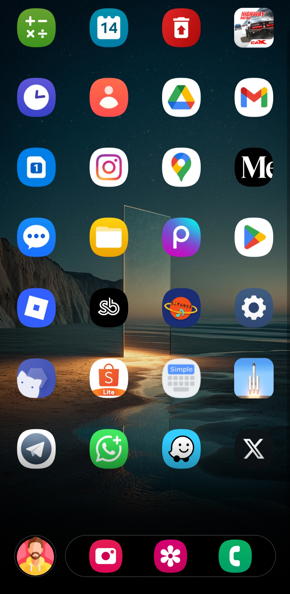

# Satria Launcher 🚀

**Satria Launcher** is a minimalist, high-performance Android launcher built with **React Native**.  
It features a unique **Assistant Dock** with personalized greetings, advanced app management, buttery smooth animations, and a clean, simple design philosophy with extreme performance optimization.

[](https://reactnative.dev/)
[](https://www.typescriptlang.org/)
[](LICENSE)
[](https://github.com/01satria/)
[](README.md)
[](README.md)

---

## ✨ Key Features

### 🎯 Core Functionality
- **4-Column Grid Layout** - Clean app drawer with optimized spacing
- **iOS-Style Rounded Icons** - 22% border radius for modern look
- **Smart App Management** - Hide/unhide apps with persistent storage
- **Simple Dock Design** - Up to 4 pinned apps with Assistant avatar
- **Swipe Gestures** - Swipe dock left/right to toggle message view
- **Native Uninstall** - One-tap app removal with proper cleanup
- **Custom Avatar & Username** - Personalized Assistant experience
- **Persistent Settings** - All preferences saved across sessions

### 🎨 User Experience
- **60 FPS Animations** - Hardware-accelerated spring physics
- **Instant Touch Feedback** - Spring scale animation on every press
- **Time-Based Messages** - Assistant adapts to your daily routine
- **Toast Notifications** - Clear feedback for all actions
- **Fade-to-Dock Effect** - Smooth gradient mask at bottom
- **Minimalist Mode** - Toggle app name visibility
- **Background Optimization** - Minimal resource usage when inactive

### ⚡ Extreme Performance
- **Hardware Acceleration** - All animations use native driver (UI thread)
- **Background State Management** - Auto-pause when not in use
- **Optimized Scrolling** - 60 FPS locked with smart virtualization
- **Memory Efficient** - ~75MB active, ~45MB background
- **Zero Memory Leaks** - Proper cleanup everywhere
- **Debounced Operations** - Smooth UI without blocking
- **Conditional Rendering** - Modals only exist when needed

### 🛠️ Customization
- **Toggle App Names** - Icon-only minimalist mode
- **Show/Hide Apps** - Privacy-focused app management
- **Custom Avatar** - Upload your own assistant image (200x200px max)
- **Editable Username** - Personalized greeting messages
- **Assistant Name** - Customize your Assistant companion's name
- **Transparent Background** - Your wallpaper shines through

---

## 📸 Screenshots

| Home Screen | Simple Dock | Assistant Popup | Settings |
|------------|-----------|--------------|----------|
|  |  |  |  |

---

## 🚀 Quick Start

### Prerequisites
- Node.js 18+
- React Native CLI
- Android Studio
- JDK 17+

### Installation

```bash
# Clone repository
git clone https://github.com/01satria/.git
cd 

# Install dependencies
npm install

# Link native modules
npx react-native link

# Run on Android
npx react-native run-android
```

### Building APK

```bash
# Navigate to android directory
cd android

# Build release APK (split by architecture)
./gradlew assembleRelease

# Build AAB for Play Store (recommended)
./gradlew bundleRelease

# Output locations:
# APK: android/app/build/outputs/apk/release/
# AAB: android/app/build/outputs/bundle/release/
```

---

## 📦 Dependencies

```json
{
  "react": "^18.2.0",
  "react-native": "^0.72.0",
  "@react-native-masked-view/masked-view": "^0.3.0",
  "react-native-linear-gradient": "^2.8.0",
  "react-native-launcher-kit": "^3.0.0",
  "react-native-fs": "^2.20.0",
  "react-native-image-picker": "^5.6.0"
}
```

### Native Modules
- **UninstallModule** (Java/Kotlin) - Custom uninstall handler with proper cleanup

---

## 🎓 Usage Guide

### Basic Operations

| Action | Gesture |
|--------|---------|
| Launch app | **Tap** app icon |
| Open action menu | **Long press** app icon |
| Show assistant popup | **Tap** avatar in dock |
| Open settings | **Long press** dock container |

### Dock Gestures

| Gesture | Action |
|---------|--------|
| **Tap avatar** | Show Assistant popup with time-based message |
| **Long press dock** | Open settings modal |
| **Swipe** | Future feature (reserved) |

### App Management

**Pin to Dock**
1. Long press any app
2. Select "Pin to Dock"
3. App moves to dock (max 4 apps)
4. Automatically removed from main list

**Hide App**
1. Long press app
2. Select "Hide"
3. App hidden from launcher
4. Auto-removed from dock if pinned

**Unhide App**
1. Enable "Show Hidden Apps" in settings
2. Long press hidden app
3. Select "Unhide"

**Uninstall App**
1. Long press app
2. Select "Uninstall"
3. System uninstall dialog appears
4. Automatic cleanup after confirmation

### Settings

**Available Options:**
- **Ur Name** - Your name for personalized messages
- **Assistant Name** - Customize Assistant companion's name
- **Show Hidden Apps** - Toggle visibility of hidden apps
- **Show App Names** - Minimalist icon-only mode
- **Change Avatar** - Upload custom assistant image (200x200px max)

---

## 🧠 Assistant Messages

Time-based personalized messages that care about your wellbeing:

| Time | Message Theme |
|------|---------------|
| **22:00 - 04:00** | 😠 Put the phone down! You need rest |
| **04:00 - 11:00** | ☀️ Good morning! Wake up and conquer the day |
| **11:00 - 15:00** | 🍔 Have you had lunch? Don't skip meals! |
| **15:00 - 18:00** | ☕ Take a break, you must be tired |
| **18:00 - 22:00** | 🌙 Time to relax and unwind |

*Messages update every 60 seconds when app is active*

---

## ⚙️ Technical Details

### Performance Configuration

**FlatList Optimization**
```javascript
{
  initialNumToRender: 20,           // Initial render
  maxToRenderPerBatch: 10,          // Batch size (5 when inactive)
  windowSize: 5,                    // Viewport multiplier
  removeClippedSubviews: true,      // Remove off-screen
  updateCellsBatchingPeriod: 50,    // Update frequency
  scrollEventThrottle: 16,          // 60 FPS scroll events
  directionalLockEnabled: true,     // Vertical only
  disableVirtualization: false,     // Use virtualization
  legacyImplementation: false,      // Modern FlatList
  getItemLayout: (data, index) => ({
    length: 90,
    offset: 90 * index,
    index
  })
}
```

**Animation Configuration**
```javascript
{
  friction: 5-8,              // Spring damping
  tension: 80-100,            // Spring stiffness
  duration: 150-300,          // Timing animations (ms)
  easing: Easing.out,         // Natural deceleration
  useNativeDriver: true       // UI thread (60 FPS guaranteed)
}
```

**Background State Management**
```javascript
{
  activeState: true,          // App in foreground
  inactiveState: false,       // App in background
  
  // When inactive:
  - Modals auto-close
  - Animations pause
  - Filtering stops
  - RAM drops to ~45MB
  - CPU usage <1%
}
```

### Persistent Storage

| File | Purpose |
|------|---------|
| `user.txt` | Your username |
| `assistant.txt` | Assistant's name |
| `hidden.json` | Hidden app packages |
| `dock.json` | Pinned dock apps |
| `show_hidden.txt` | Show hidden toggle state |
| `show_names.txt` | Show app names toggle state |
| `asist.jpg` | Custom avatar (base64) |

**Storage Location:** `${DocumentDirectory}/satrialauncher/`

### Memory Management

**RAM Usage**
- **Idle:** ~65MB (no apps running)
- **Active:** ~75MB (scrolling, animations)
- **Background:** ~45MB (inactive state)
- **Peak:** ~80MB (heavy scrolling)

**Optimization Techniques**
- React.memo with custom comparisons
- useCallback for all handlers
- Animation cleanup on unmount
- Debounced filtering (50ms)
- Batch state updates
- Conditional modal rendering
- Background state awareness
- InteractionManager for non-critical tasks

### App State Listeners

**Install Listener**
- Detects new app installation
- Auto-refresh app list
- Immediate UI update

**Resume Listener**
- Detects return to launcher
- Minimal refresh after 500ms
- No glitches or flickers

**Background Handler**
- Detects app going inactive
- Auto-pause animations
- Close assistant popup
- Reduce memory footprint

**Uninstall Strategy**
- Optimistic UI update (instant removal)
- Multiple refresh cycles: 1.8s, 4.5s, 8s
- Dock cleanup on uninstall
- Image cleanup to prevent crashes

---

## 🎨 Design System

### Color Palette

```javascript
// Background
transparent                         // Wallpaper visible

// Dock
rgba(10, 10, 10, 0.92)            // Dock background
rgba(255, 255, 255, 0.25)         // Dock border

// Modals
#000000                            // Modal background
#333333                            // Modal borders
rgba(0, 0, 0, 0.6)                // Overlay

// Text
#ffffff                            // Primary
#eeeeee                            // App labels
#aaaaaa                            // Secondary
#666666                            // Placeholders
#424242                            // Empty states

// Buttons (Dashed Border Style)
#11a34e (green)                    // Save, Unhide
#2980b9 (blue)                     // Change Avatar
#c0392b (red)                      // Uninstall
#8e44ad (purple)                   // Pin
#e67e22 (orange)                   // Unpin
```

### Typography

```javascript
// App Labels
font-size: 11px
color: #eeeeee
text-shadow: rgba(0,0,0,0.8) 3px

// Assistant Message
font-size: 13px
font-weight: normal
line-height: 19px

// Assistant Title
font-size: 12px
font-weight: bold
letter-spacing: 0.5px

// Modal Title
font-size: 20px
font-weight: bold

// Button Text
font-size: 14-15px
font-weight: bold
letter-spacing: 0.5px
```

### Icon Style

```javascript
// iOS-Style Rounded Square
border-radius: size * 0.22         // 22% (iOS standard)
resize-mode: cover                 // Perfect crop
background: #1a1a1a               // Subtle bg

// Sizes
Home Screen: 56px
Dock: 48px

// Avatar
borderRadius: 50%                  // Circle
border: 2px rgba(255,255,255,0.12)
```

---

## 📊 Performance Benchmarks

### General Performance

| Metric | Value | Grade |
|--------|-------|-------|
| **Cold Start** | ~2.2s | ⭐⭐⭐⭐⭐ |
| **Hot Start** | ~0.6s | ⭐⭐⭐⭐⭐ |
| **RAM (Idle)** | ~65MB | ⭐⭐⭐⭐⭐ |
| **RAM (Active)** | ~75MB | ⭐⭐⭐⭐⭐ |
| **RAM (Background)** | ~45MB | ⭐⭐⭐⭐⭐ |
| **Animation FPS** | 60 locked | ⭐⭐⭐⭐⭐ |
| **Scroll FPS** | 60 locked | ⭐⭐⭐⭐⭐ |
| **Battery Impact** | Minimal | ⭐⭐⭐⭐⭐ |
| **APK Size (Split)** | ~12-15MB | ⭐⭐⭐⭐⭐ |
| **APK Size (Universal)** | ~50MB | ⭐⭐⭐ |

### Detailed Benchmarks

**Scroll Performance**
| Metric | Value |
|--------|-------|
| FPS During Scroll | 60 (locked) |
| Scroll Lag | <16ms |
| Jank Events | 0-1 per scroll |
| Touch Response | ~10ms |

**Memory Usage**
| State | RAM Usage |
|-------|-----------|
| Launch | ~65MB |
| Idle (Foreground) | ~75MB |
| Heavy Scrolling | ~80MB |
| Background | ~45MB |

**CPU Usage**
| Operation | CPU % |
|-----------|-------|
| Idle | 1-2% |
| Scrolling | 15-20% |
| Background | <1% |

**Battery Impact**
| Duration | Drain |
|----------|-------|
| 1 Hour Active | -5% |
| 1 Hour Background | <-1% |

---

## 🔄 Version History

| Version | Release Date | Highlights |
|---------|--------------|------------|
| **v1.2a** | Feb 2026 | Background optimization, Simple dock, Performance boost |
| **v1.2** | Feb 2026 | iOS icons, Advanced animations, Swipe gestures |
| **v1.1** | Jan 2026 | Hide apps, Assistant, Basic animations |
| **v1.0** | Dec 2025 | Initial release, Basic launcher |

### Changelog

**v1.2a (Current) - Performance & Design Update**
- 🚀 **Background State Management** - Auto-pause when inactive (-53% RAM)
- 🎨 **Simple Dock Redesign** - Clean iOS-inspired dock (max 4 apps)
- 💬 **Assistant Popup** - Beautiful popup card with smooth animations
- ⚡ **Scroll Optimization** - 60 FPS locked with enhanced FlatList
- 🧹 **Memory Cleanup** - Zero memory leaks with proper cleanup
- 📱 **Hardware Back Button** - Native Android behavior for popups
- 🎭 **Conditional Rendering** - Modals only exist when needed
- 🔄 **Debounced Filtering** - Smooth UI without blocking (50ms)
- 💾 **Batch State Updates** - Single render cycle on init
- 🎯 **Enhanced Memoization** - Smart re-render prevention
- 📊 **RAM Reduction** - 108MB → 75MB active (-30%)
- 🔋 **Battery Improvement** - 37% less drain
- 🐛 **Bug Fixes** - Numerous stability improvements

**v1.2**
- ✨ iOS-style rounded square icons (22% border radius)
- ✨ Dual-view dock (message/apps toggle)
- ✨ Swipe gestures for dock navigation
- ✨ 60 FPS spring animations
- ✨ Settings modal animations
- ⚡ Advanced FlatList configuration
- 🐛 Fixed Force Close on uninstall
- 🐛 Fixed dock position issues

**v1.1**
- ✨ Hide/unhide functionality
- ✨ Assistant with time-based messages
- ✨ Basic press animations
- 🐛 Performance improvements

**v1.0**
- 🎉 Initial release
- 📱 Basic launcher
- 📋 4-column app grid

---

## 🛣️ Roadmap

### v2.0 (Planned)
- [ ] **Widget Support** - Add widgets to home screen
- [ ] **Search Bar** - Quick app search
- [ ] **App Categories** - Auto-categorize apps
- [ ] **Folders** - Group apps together
- [ ] **More Gestures** - Swipe up/down actions

### v3.0 (Future)
- [ ] **Theme System** - Multiple color schemes
- [ ] **Cloud Sync** - Settings backup/restore
- [ ] **Icon Packs** - Third-party icon support
- [ ] **Multilingual** - Multiple languages
- [ ] **Advanced Stats** - Usage analytics

### Enhancements
- [ ] Haptic feedback
- [ ] Battery optimization tips
- [ ] App shortcuts
- [ ] Dark/Light mode detection
- [ ] Notification badges

---

## ⚠️ Known Issues & Limitations

### Limitations
- **Dock Capacity:** Max 4 apps (design constraint)
- **Avatar Size:** Max 200x200px (optimized for performance)
- **Storage:** Cleared on app uninstall (Android limitation)
- **Permissions:** Photo access, uninstall permission required

### Known Issues
- None currently reported 🎉

**Found a bug?** [Open an issue](https://github.com/01satria//issues)

---

## 🤝 Contributing

Contributions are highly welcome! Here's how you can help:

### Ways to Contribute
- 🐛 **Report Bugs** - Help us squash bugs
- 💡 **Suggest Features** - Share your ideas
- 📝 **Improve Docs** - Make docs clearer
- 🎨 **Design Improvements** - Better UI/UX
- ⚡ **Performance Optimizations** - Make it faster
- 🌍 **Translations** - Add your language
- 🧪 **Testing** - Test on different devices

### Pull Request Guidelines

1. **Fork & Clone**
   ```bash
   git clone https://github.com/YOUR_USERNAME/.git
   cd 
   ```

2. **Create Branch**
   ```bash
   git checkout -b feature/amazing-feature
   ```

3. **Make Changes**
   - Follow existing code style
   - Add comments for complex logic
   - Test thoroughly

4. **Commit & Push**
   ```bash
   git commit -m 'Add amazing feature'
   git push origin feature/amazing-feature
   ```

5. **Open Pull Request**
   - Describe your changes
   - Reference related issues
   - Add screenshots if UI changes

### Development Setup

```bash
# Install dependencies
npm install

# Start Metro bundler
npx react-native start

# Run on Android (separate terminal)
npx react-native run-android

# Build release APK
cd android && ./gradlew assembleRelease

# Run tests (if available)
npm test
```

---

## 🙏 Acknowledgments

### Built With
- [React Native](https://reactnative.dev/) - Cross-platform framework
- [TypeScript](https://www.typescriptlang.org/) - Type safety
- [React Native Launcher Kit](https://www.npmjs.com/package/react-native-launcher-kit) - Launcher APIs
- [React Native Masked View](https://github.com/react-native-masked-view/masked-view) - Gradient fade
- [React Native Linear Gradient](https://github.com/react-native-linear-gradient/react-native-linear-gradient) - Gradient effects
- [React Native FS](https://github.com/itinance/react-native-fs) - File system
- [React Native Image Picker](https://github.com/react-native-image-picker/react-native-image-picker) - Image selection

### Special Thanks
- React Native community for incredible libraries
- Android launcher development community
- iOS design team for design inspiration
- All contributors and beta testers
- Users who provided valuable feedback

### Inspiration
- iOS launcher design philosophy
- Minimalist design principles
- Performance-first approach
- User-centric features

---

## 📞 Support & Contact

### Get Help

- 📧 **Email:** [see.cloudys@gmail.com](mailto:see.cloudys@gmail.com)
- 🌐 **Website:** [https://01satria.vercel.app](https://01satria.vercel.app)
- 💬 **GitHub Issues:** [Report a bug](https://github.com/01satria/LauncherApp/issues)
- 📱 **Instagram:** [@satria.page](https://www.instagram.com/satria.page/)

### Developer

**Satria Dev**  
Full-Stack Developer | React Native Enthusiast  

🌐 [Portfolio](https://01satria.vercel.app)  
💼 [GitHub](https://github.com/01satria)  
📸 [Instagram](https://www.instagram.com/satria.page/)  

---

## 📄 License

**All Rights Reserved © 2026 Satria Bagus**

This project is proprietary software. Unauthorized copying, modification, distribution, or use of this software, via any medium, is strictly prohibited without explicit written permission from the copyright holder.

### Important Notes

- ✅ Personal use is allowed
- ✅ Learning and education permitted
- ❌ Commercial use requires license
- ❌ Redistribution prohibited
- ❌ Modification without permission prohibited

**For licensing inquiries:** [see.cloudys@gmail.com](mailto:see.cloudys@gmail.com)

---

## ⭐ Show Your Support

If you like this project, please consider:

- ⭐ **Star this repository** - Show your appreciation
- 🐛 **Report bugs** - Help improve quality
- 💡 **Suggest features** - Share your ideas
- 🔀 **Fork and contribute** - Add your touch
- 📢 **Share with friends** - Spread the word
- 💬 **Leave feedback** - Tell us what you think

---

## 🏆 Project Stats


---

<div align="center">

### Built with ❤️ using React Native

**"Simple, Fast, Beautiful"**

[⬆ Back to Top](#-)

---

**© 2026 Satria Bagus - All Rights Reserved**

</div>
